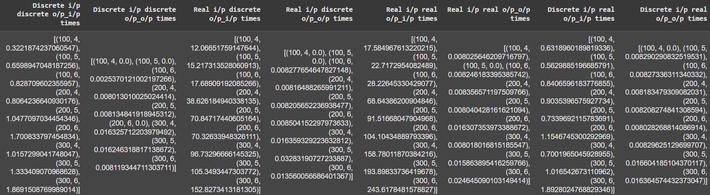

# Decision Tree Implementation

# Q1

## Real Input and Real Output

Output:
Criteria : mse
RMSE: 0.7633893767323656
MAE: 0.5353831541447371

## Real Input and Discrete Output

Output:
Criteria : information_gain
Accuracy: 0.9333333333333333
Class 4
Precision: 1.0
Recall: 1.0
Class 1
Precision: 1.0
Recall: 0.8333333333333334
Class 2
Precision: 1.0
Recall: 1.0
Class 3
Precision: 1.0
Recall: 1.0
Class 0
Precision: 0.3333333333333333
Recall: 1.0
Criteria : gini_index
Accuracy: 0.8333333333333334
Class 4
Precision: 0.7
Recall: 1.0
Class 1
Precision: 0.9
Recall: 1.0
Class 2
Precision: 1.0
Recall: 0.5
Class 3
Precision: 1.0
Recall: 1.0
Class 0
Precision: 0.6666666666666666
Recall: 1.0

## Discrete Input and Discrete Output

Criteria : information_gain
Accuracy: 0.9333333333333333
Precision: 0.8571428571428571
Recall: 1.0
Precision: 1.0
Recall: 1.0
Precision: 1.0
Recall: 0.9
Precision: 0.8
Recall: 1.0
Precision: 1.0
Recall: 0.8333333333333334
Criteria : gini_index
Accuracy: 0.9
Precision: 0.8571428571428571
Recall: 0.75
Precision: 0.75
Recall: 0.75
Precision: 0.8888888888888888
Recall: 1.0
Precision: 1.0
Recall: 1.0
Precision: 1.0
Recall: 1.0

## Discrete Input and Real Output

Criteria : mse
RMSE: 0.7678411037503249
MAE: 0.47085134831056263

# Q2

Criteria : information_gain
Accuracy: 0.9142857142857143
Precision: 0.84375
Recall: 0.9642857142857143
Precision: 0.9736842105263158
Recall: 0.8809523809523809
Criteria : gini_index
Accuracy: 0.9142857142857143
Precision: 0.84375
Recall: 0.9642857142857143
Precision: 0.9736842105263158
Recall: 0.8809523809523809

2b does not have any output, only code

# Q3

## a.

RMSE from my model: 7.689969053160106

## b.

RMSE from Scikit learn: 2.9225527007101078

# Q4

In the tuple the first value is N, second M, and the last the time taken.

## Human Activity Recognition (HAR)

# Q1

1. We could see, The activities like Walking, walking_upstairs,walking_downstairs have more fluctuating waveforms.
2. And for others class of activites(sitting, standing,laying)show stable/flatter waveforms
3. As we can see on above output, there are differences between the given activities. But Some dynamic activities may look similar (walking upstairs vs. downstairs).
4. There are some neural network models those can be work on above activites

# Q2

    Static activities(sitting, standing, laying):There are means the involve very little movement, so the acceleration magnitude a should be relatively low and stable. We simply say, the variance in magnitude is very low
    Dynamic activities(walking, walking upstairs , walking downstairs) : it involves very high waveform movement so the accesleration magnitude a should be high and instable. Here variance in magnitude is very high.
    If the acceleration magnitude a shows a clear difference in variability or mean value between these two groups, a simple threshold-based rule could work quite well
    	A=sqrt(accx2+accy2+accz2)

1. Linear acceleration magnitude can easily separate static from dynamic activities, likely without needing a full machine learning model.
2. This is because static activities show low variance in acceleration magnitude while dynamic activities have higher variance due to movement.
3. Machine learning models become essential when classifying within these groups (e.g., sitting vs standing, or walking vs walking upstairs).

# Q3

Subtask 4.
• PCA on Total Acceleration Magnitude
• It is working on formula A=sqrt(accx2+accy2+accz2)  
• It is Simple and raw data-based
• PCA on TSFEL-extracted features:
• It is working on Statistical and temporal features extracted from raw accelerometer data (or acceleration magnitude) using TSFEL.
• It provides us feature set to capture time and frequency info
• PCA on provided dataset features:
• Features already precomputed and provided by the UCI HAR dataset

Raw total acceleration PCA is useful as a quick baseline but limited due to reduced information content.
TSFEL is flexible and can be customized, which is valuable in exploratory analysis or new datasets.
Hence For better class discrimination and feature understanding, PCA on TSFEL features is more powerful.

Question 4.

    We have calculated the correlation matrix for TSFEL and features provided in dataset. Now we found that there are some features those are very correlated (>9.0) are
    tBodyAcc-mean()-X
    tBodyAcc-mean()-y
    tBodyAcc-mean()-Z

Redundant features don’t add new information beacuase:
• Lead to overfitting.
• Increase training time.
• Obscure model interpretability.
